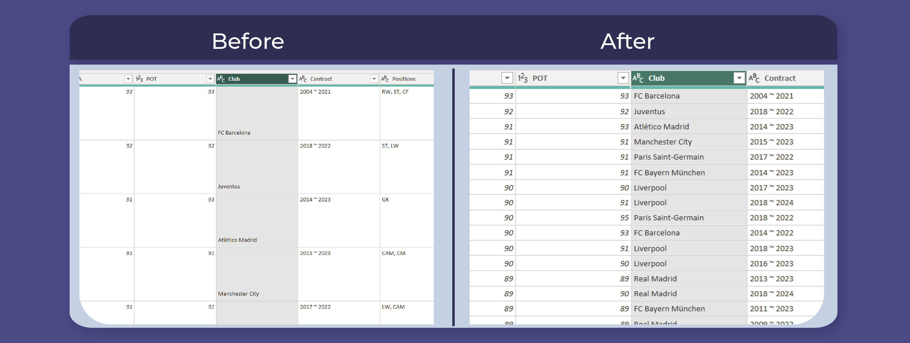
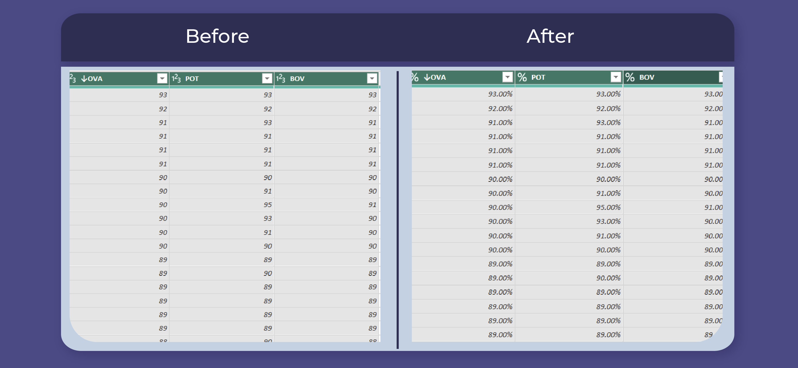
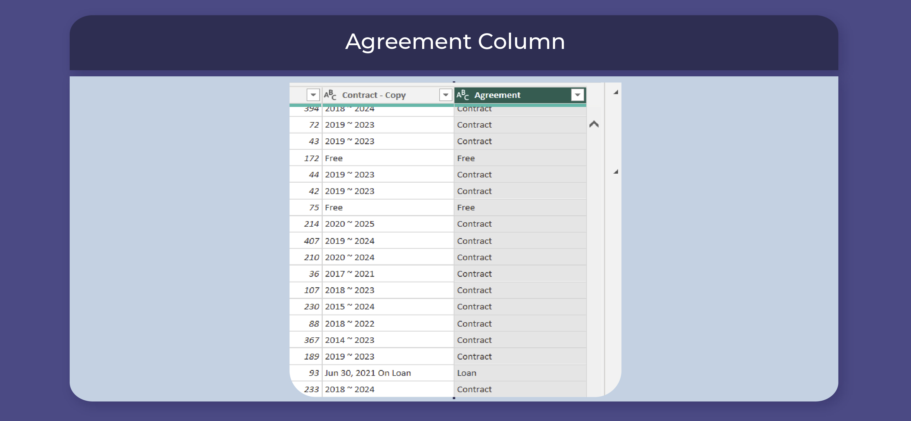
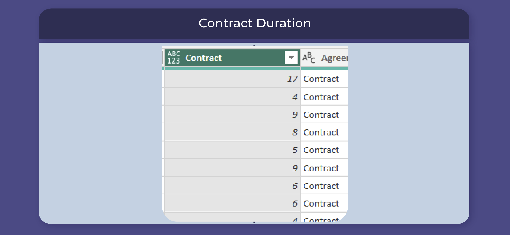

# **FIFA 21 DATA CLEANING**


## Introduction
This documentation outlines the data cleaning process for the **FIFA 21 dataset**, which was obtained from [Kaggle.](https://www.kaggle.com/datasets/yagunnersya/fifa-21-messy-raw-dataset-for-cleaning-exploring) The raw data file was named "fifa21 raw data v2.csv" and was provided as part of a **Data Cleaning Challenge** for data analysts of all levels. The data cleaning process was completed using Power Query, a powerful data transformation tool. The purpose of this project was to clean and prepare the dataset for further analysis.

## Data Description
The FIFA 21 dataset contains 18,979 rows and 77 columns. The dataset includes a variety of data types, including whole numbers, text, and dates. The columns contain a range of information related to FIFA player statistics, such as player name, club, nationality, position, earnings, performance metrics and so on.

## Data Cleaning Process
Using M language and a host of tools available in Power Query Editor, I was able to perform the following transformations to the data set;

### - Photo URL Correction
During the data cleaning process, an issue was identified with the "Photo URL" column. The column contained URLs to each player's photo, but it was noticed that the URLs contained an error that caused the photos to be unavailable.

For example, the original URL for one player was:
https://cdn.sofifa.com/players/158/023/21_60.png
This URL contained an error that prevented the photo from loading correctly. To fix this issue, a transformation was applied to the dataset to correct the URLs.


By applying this transformation, the "Photo URL" column was cleaned and standardized to contain the correct URLs, which improved the accuracy and completeness of the data.
https://cdn.sofifa.net/players/158/023/21_240.png 

### - String/Text Cleaning:
One of the issues identified during the data cleaning process was with the "Club" column. The column contained some dirty data that needed to be cleaned. To clean the data in this column, the Power Query function Text.Clean was used. By applying this transformation, any extraneous whitespace, line breaks, or other non-printable characters were removed from the "Club" column, resulting in a cleaner, more consistent dataset. _[see preview below;]_ 👇



### - Columns OVA, POT & BOV Transformation
During the data cleaning process, it was noticed that the columns labelled "OVA", "POT", and "PAC" contained values that were measured as percentages, but were entered as text data types. To correct this issue, a transformation was applied to the dataset to convert the values to a percentage format and change the data type to percentage.
_[see preview below;]_ 👇



By applying this transformation, the "OVA", "POT", and "PAC" columns were cleaned and standardized to a consistent percentage format, which improved the accuracy and usefulness of the data.

### - Contract Column Transfromation

The "Contract" column contained contract start year, contract end year (separated by "~"), as well as the values "Free" (for players not on contract) and "Loan Date" (for players on loan). To improve the accuracy and usefulness of the data, two transformations were applied to this column.

First, a new column called "Agreement" was created to indicate the type of agreement for each player.



Second, a new column called "Contract Duration" was created to calculate the duration of each player's contract in years. This was done using the following transformation:

```
if Text.Contains([Contract], "~")
then Number.From( Text.AfterDelimiter([Contract], "~"))- Number.From( Text.BeforeDelimiter([Contract], "~"))
else [Agreement]
```

This transformation used the Text.BeforeDelimiter and Text.AfterDelimiter functions to extract the contract start year and contract end year from each row in the "Contract" column, and then calculated the difference between them to determine the duration of the contract in years. If the "Agreement" column indicated that the player was not on a contract ("Free" or "Loan"), the corresponding row in the "Agreement" column is returned.



By applying these transformations, the "Contract" column was cleaned and standardized to include information on the type of agreement for each player, as well as the duration of their contract (if applicable), which improved the accuracy and usefulness of the data.
